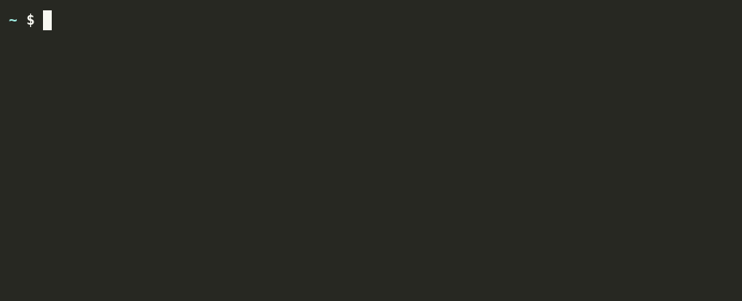
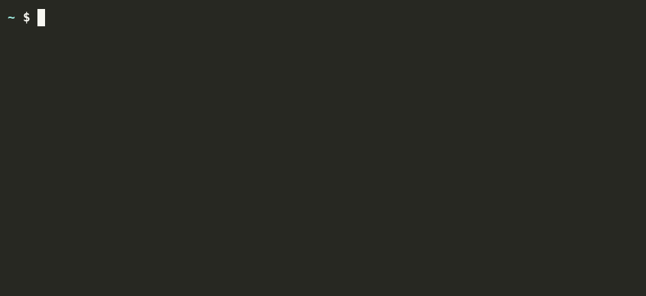
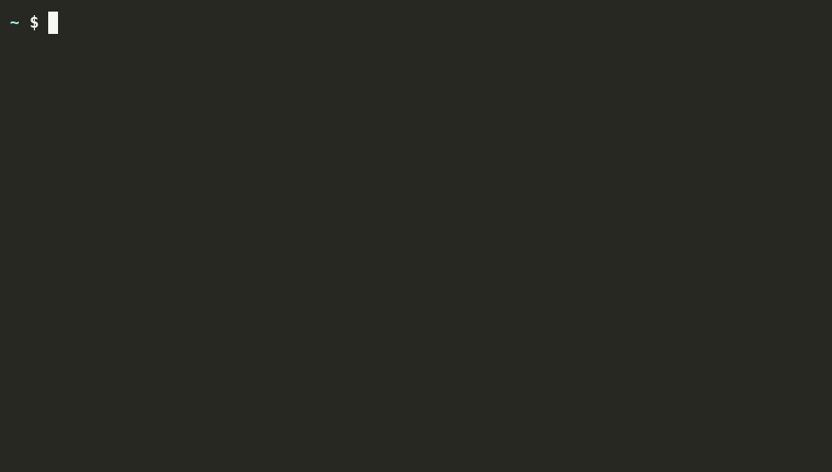
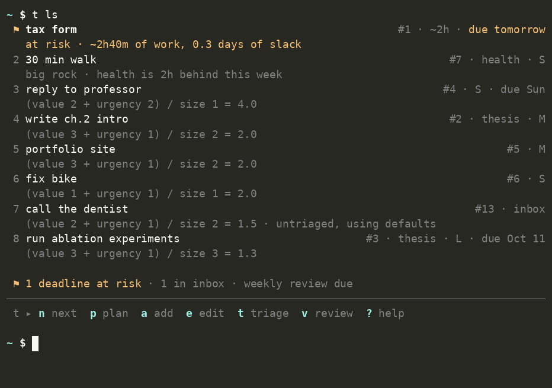
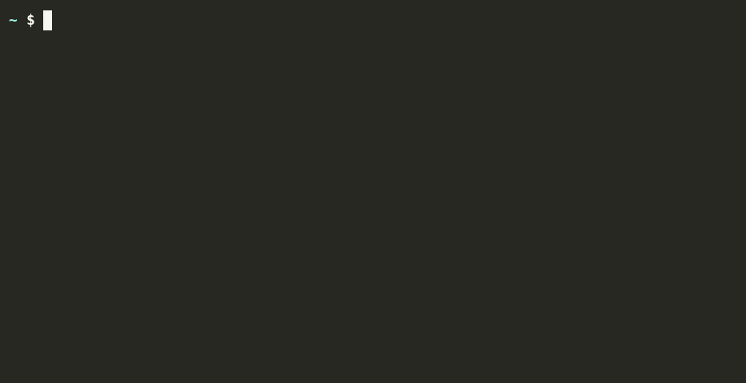
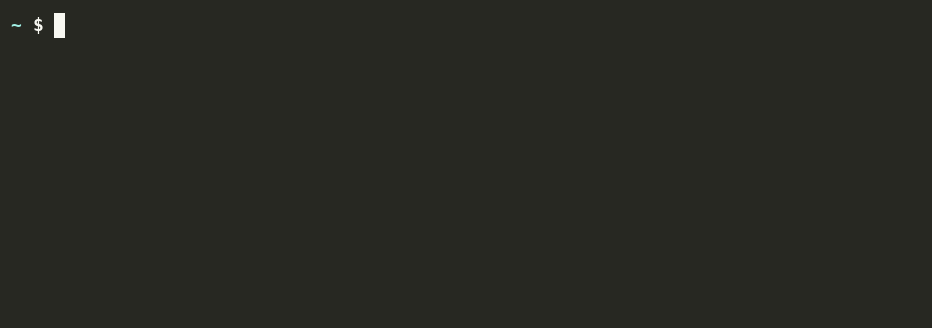
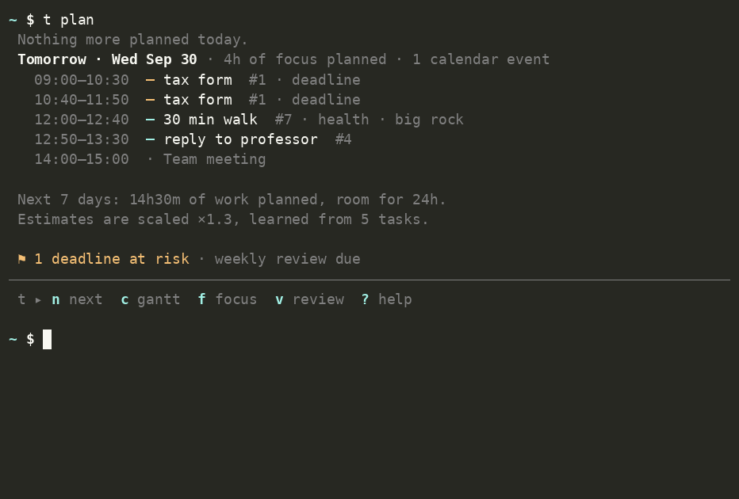
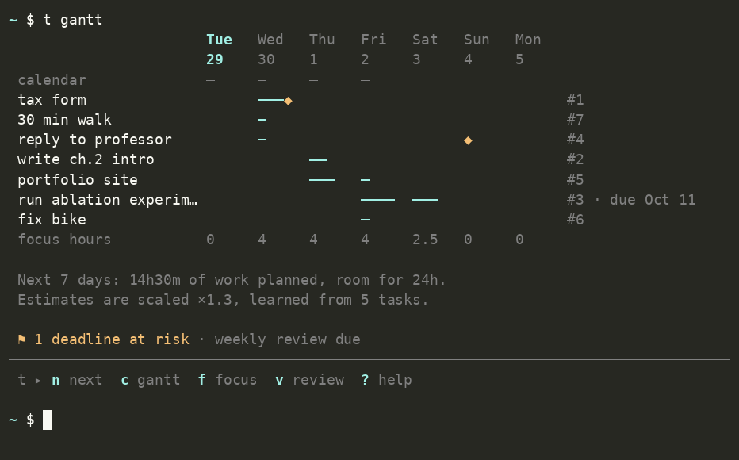
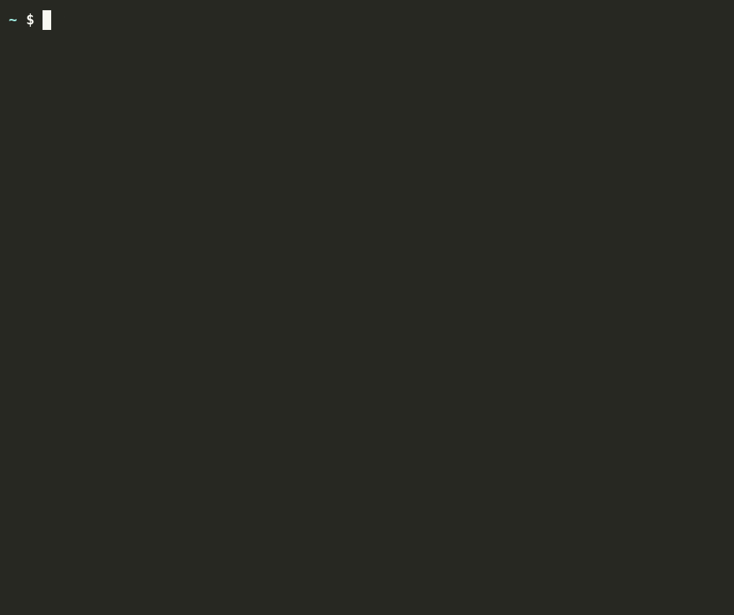

# tend

A task manager for the terminal. It shows one task at a time, tells you why it
picked that task, and keeps long-term goals from being forgotten.



## Why

Most task apps show a long list and ask you to choose. For many people, and
especially people with ADHD, choosing is the hard part. You look at the list,
freeze, and then pick whatever is most urgent. Important work with a far
deadline waits until it becomes an emergency.

tend makes the choice for you with three simple rules, each taken from an
existing planning method. It shows the reason next to the task. If you don't
like the choice, press `s` to skip it. You don't need to give a reason.

Other design choices:

- Adding a task takes one command, with no required fields.
- Every screen ends with a command bar that lists the keys you can use right now.
- Missed deadlines are never hidden, and they are never shown as a red wall.
  Each one needs a decision (see [Missed dates](#missed-dates)).
- `t plan` builds a schedule around your calendar with the same rules.
- tend learns how long your tasks really take and corrects your estimates.
- Your data is a plain SQLite file. Every command can print JSON.

## Install

You need Python 3.11 or newer. The only dependencies are `rich` and `python-dateutil`.

```sh
git clone https://github.com/alexhergomz/Tend.git tend
cd tend
uv tool install --editable .     # or: pipx install --editable .
```

This installs two commands, `t` and `tend`, which are the same program.

## Quick start

```sh
t call the dentist                          # anything that is not a command becomes a task
t write ch.3 outline +thesis due:fri v:3 e:2h
t g add thesis 3h                           # a goal with a weekly target
t next                                      # show the one task to do now
t                                           # interactive mode
```



New tasks without details go to the **inbox**. They are still in the queue, with
default values. Run `t triage` to sort them. It asks three questions per task,
and each one takes a single keypress.



## How tend picks the next task

The rules run in order. The first rule that matches decides.

**1. A deadline at risk comes first.**
tend computes the *slack* of each task with a hard deadline:

```
slack = days until the deadline − hours of work left ÷ focus hours per day
```

If the slack is 1 day or less, the task goes to the top. This warns you while
there is still time to act. The idea comes from the Critical Path Method.

**2. One goal task per day.**
Until you have worked on a goal today, the next task comes from the goal that is
furthest behind its weekly target. This keeps long-term work moving. It is the
"big rocks" idea (Covey), also known as "eat the frog".

**3. Everything else by WSJF.**
WSJF means Weighted Shortest Job First. It comes from Lean product development.

```
priority = (value + urgency) / size
```

| | 1 | 2 | 3 |
|---|---|---|---|
| **value** (you set it) | nice to have | matters | really matters |
| **urgency** (computed from slack) | more than 7 days, or no date | 2 to 7 days | less than 2 days |
| **size** (you set it) | S, under 1 hour | M, 1 to 3 hours | L, over 3 hours |

If two tasks have the same score, the older task wins. Tasks you skipped today
go to the end of the queue.

`t ls` shows the full queue and the rule or arithmetic behind each position:



There are no hidden weights to tune. The only settings are the focus hours per
day (default 4) and the slack limit for rule 1 (default 1 day).

## Missed dates

tend has two kinds of date:

- `due:` is a **hard deadline**. Missing it has a real cost, for example a late fee.
- `aim:` is a **soft target**. It is a date you set for yourself.

A task **slips** when its date passes and the task is not done.

- **Soft target:** the first two times, tend moves the date to today without a
  message. The third time, the task needs a decision.
- **Hard deadline:** the task needs a decision right away.

tend never hides these tasks. The status line under every command shows how many
need a decision, for example `2 slipped`. The count stays until you decide.

### Deciding: `t resolve`

`t resolve` (key `r`) shows the slipped tasks one at a time. For each task, you
press one key:

| Key | Choice | What changes |
|---|---|---|
| `n` | do it today | The date moves to today. The task goes back into the normal queue. |
| `r` | reschedule | You type a new date. You can't skip this step, because a concrete date makes follow-through more likely (Gollwitzer's work on implementation intentions). For a hard deadline this sets a new `due:` date, so only use it if the deadline really moved. |
| `x` | split | You type smaller steps. The steps become new tasks and the original waits for them. |
| `k` | drop | The task is removed. This is a valid choice, not a failure. `t undo` brings it back. |
| `q` | later | Stop for now. The remaining tasks stay in the `slipped` count. |

After `n`, `r` or `x`, the slip count starts again at zero, so a missed soft
target gets two quiet rollovers again.

Example: "reply to professor" missed its hard deadline, so it gets a new one
(`r`, then `fri`). "fix bike" missed its soft target three times, so it gets
dropped (`k`).



## Focus timer

`t focus` starts a timer on the current task. It has three modes:

| Mode | Flag | How it works |
|---|---|---|
| Pomodoro | `--pomo` (default) | 25 minutes of work, then a 5 minute break |
| Flow | `--flow` | Counts up with no forced stop. Press `b` to take a break. The break length is 20% of the time you worked. |
| Timebox | `--box 45` | Stops after the given number of minutes |

The timer sends a desktop notification when a phase ends (`notify-send` on Linux).
Time is saved per task and counts toward goal progress.



*The GIF uses a 1 minute pomodoro and plays at 4x speed.*

## Planning: `t plan` and `t gantt`

`t plan` shows a schedule for today. If the working day is already over, it
shows tomorrow.



The plan does not use a separate algorithm. For each free time slot, it asks the
same question as `t next`: "which task comes first at this point?" It books a
block for that task and repeats. So the plan and `t next` always agree.

- **Free time** is the working window (09:00 to 18:00 by default) minus your
  calendar events.
- **Focus per day** is limited to `hours_per_day` (4 by default). The rest of
  the window stays free, as a buffer for things that come up.
- **Blocks** are at most 90 minutes, with a 10 minute gap between them.
- **Warnings** appear when a deadline won't be met, with the amount of work
  that doesn't fit.
- **Nothing is saved.** The plan is rebuilt every time you run it, so it is
  never out of date. If your day goes wrong, run `t plan` again.

`t gantt` (key `c`) shows the next 7 days as a chart. Each row is a task and each
line is the focus time for that day. `◆` marks a deadline. Use `--days 14` for a
longer view.



To export the plan to your own calendar app, run `t plan --ics > plan.ics`.

### Calendar

tend reads busy times from `.ics` files or URLs. Most calendar apps can give
you one. In Google Calendar, open *Settings and sharing* for your calendar, then
copy *Secret address in iCal format*. Add it to the config:

```toml
[calendar]
ics = ["~/calendars/uni.ics", "https://calendar.google.com/calendar/ical/.../basic.ics"]
```

tend supports repeating events, time zones, deleted and moved repeats, and
events marked as "free". All-day events don't block any hours. URLs are cached
for 15 minutes. If you are offline, tend uses the last copy.

## Estimate calibration

Most people underestimate how long tasks take. tend measures this. When you
finish a task that has focus time, tend compares the time you spent with the
estimate. The **calibration factor** is the median of this ratio over your last
20 timed tasks.

If your tasks take 1.3 times your estimate, tend multiplies every estimate by
1.3 before it computes slack or builds a plan. You don't need to change how you
estimate.

- It starts after 5 timed tasks. Before that, the factor is 1.
- The median ignores a few extreme tasks.
- The factor stays between 0.5 and 3.
- `t plan` and `t review` show the current factor. To turn it off, set
  `calibrate = false`.

## Weekly review

Once a week, the status line shows `weekly review due`. Run `t review` (key `v`).
It takes about five minutes and has six steps:

1. **Last 7 days:** what you finished, and each goal against its target.
2. **Estimates:** your calibration factor, in plain words.
3. **Inbox:** triage new tasks now, or skip.
4. **Slipped tasks:** resolve them now, or skip.
5. **Old tasks:** tasks older than 30 days, with no date and no focus time.
   Keep them, give them a date, or drop them.
6. **Goals:** if a goal has no open tasks, rule 2 can't help it. tend asks you
   for one small next step.

Press `q` at any question to stop.



## Commands

Each command has a one-letter key. `t d` is the same as `t done`. In interactive
mode (`t` with no arguments), you only press the letter.

| Key | Command | What it does |
|---|---|---|
| `n` | `next` | Show the one task to do now |
| `f` | `focus` | Start the focus timer (`--pomo`, `--flow`, `--box 45`) |
| `d` | `done` | Mark the task as done |
| `s` | `skip` | Skip the task for today |
| `x` | `split` | Split the task into smaller steps: `t x "outline" "draft intro"` |
| `a` | `add` | Add a task. `t <text>` also works. |
| `t` | `triage` | Sort the inbox |
| `l` | `ls` | Show the full queue with reasons |
| `e` | `edit` | Change a task: `t e 12 due:fri v:3` |
| `k` | `drop` | Remove a task you no longer need |
| `r` | `resolve` | Decide what to do with slipped tasks |
| `p` | `plan` | Show today's schedule (`--ics` exports it) |
| `c` | `gantt` | Show the next 7 days as a chart (`--days 14`) |
| `v` | `review` | Weekly review |
| `g` | `goals` | Show goal progress. `t g add thesis 3h` adds a goal, `t g rm thesis` removes it. |
| `w` | `wins` | Show what you finished today (`--week` for the whole week) |
| `u` | `undo` | Undo the last change |
| `?` | `help` | Show all commands and the syntax |

Without an id, `done`, `skip`, `split`, `edit`, `drop` and `focus` act on the
task that `next` showed last.

## Syntax for adding tasks

Words become the title. Tokens set the fields. You can put tokens anywhere.

| Token | Meaning | Example |
|---|---|---|
| `+name` | Goal | `+thesis` |
| `due:<date>` | Hard deadline | `due:fri` |
| `aim:<date>` | Soft target | `aim:+3d` |
| `after:<date>` | Hide the task until this date | `after:mon` |
| `v:1` to `v:3` | Value | `v:3` |
| `s:S`, `s:M`, `s:L` | Size | `s:M` |
| `e:<time>` | Estimate. Also sets the size. | `e:45m`, `e:2h`, `e:1h30m` |

Dates: `today`, `tom`, `mon` to `sun`, `+3d`, `+2w`, `oct20`, `10-20`,
`2026-10-20`, `eow` (end of week), `eom` (end of month). Use `due:none` to
clear a date.

`!2` and `~45m` also work, but zsh changes them before tend can read them.
Use them only inside quotes.

## Your data

All data is in one SQLite file. Run `t ?` to see its path. By default it is
`~/.local/share/tend/tend.db`.

| Table | Contents |
|---|---|
| `tasks` | All tasks, including done and dropped ones |
| `goals` | Goals and their weekly targets, in minutes |
| `sessions` | Focus timer sessions |
| `events` | Every change, with a copy of the task before and after. Undo uses this table. |

Any command prints JSON with `--json`:

```sh
t ls --json | jq -r '.[] | "\(.score)\t\(.title)"'
t wins --week --json > week.json
sqlite3 ~/.local/share/tend/tend.db \
  "SELECT goal, SUM(minutes) FROM sessions JOIN tasks ON tasks.id = task_id GROUP BY goal"
```

## Configuration

The config file is `~/.config/tend/config.toml`. tend creates it on first run,
with a comment on each option.

```toml
[focus]
default_mode = "pomo"     # pomo | flow | box
pomo_work = 25            # minutes
pomo_break = 5
box_minutes = 45
flow_break_ratio = 0.2

[priority]
hours_per_day = 4         # focused hours per day, used to compute slack
at_risk_slack_days = 1    # rule 1 limit
calibrate = true          # scale estimates by how long tasks really take

[schedule]
day_start = "09:00"       # t plan only books time inside this window
day_end = "18:00"
work_days = ["mon", "tue", "wed", "thu", "fri", "sat", "sun"]
max_block = 90            # longest focus block, in minutes
break_minutes = 10        # gap between blocks
horizon_days = 14         # how far ahead t plan checks deadlines

[calendar]
ics = []                  # .ics files or URLs with busy times

[review]
every_days = 7

[slips]
quiet_rollovers = 2       # how many times a missed soft target moves without a message

[ui]
footer = true             # show the command bar
```

Set `TEND_DB` or `TEND_CONFIG` to use a different data file or config file.

## Development

```sh
uv sync
uv run pytest
```

The code is small and split by job:

| File | Job |
|---|---|
| `priority.py` | The three rules. Pure functions with no I/O, so you can replace them. |
| `plan.py` | The scheduler. It calls `priority.py` for every free slot. |
| `ics.py` | Reads calendar files |
| `calibrate.py` | Estimate calibration |
| `store.py` | SQLite schema, events and undo |
| `parse.py` | Syntax for tasks, dates and durations |
| `commands.py` | One function per command |
| `tui.py`, `focus.py` | Interactive mode and the timer |

The GIFs are recordings of the real program. To rebuild them, run
`docs/demo/render.sh`. It needs [agg](https://github.com/asciinema/agg) and
ffmpeg.

## Roadmap

- **0.1:** capture, triage, the three rules, focus timer, slipped tasks, undo, JSON
- **0.2:** estimate calibration and the weekly review
- **0.3:** `t plan`, `t gantt`, calendar import and `.ics` export
- **0.4 (next):** hooks (`on_done`, `on_focus_start`) and plugins. Any `t-<name>`
  program on your PATH becomes `t <name>`.
- **Later:** energy windows (for example, hard tasks in the morning only)
